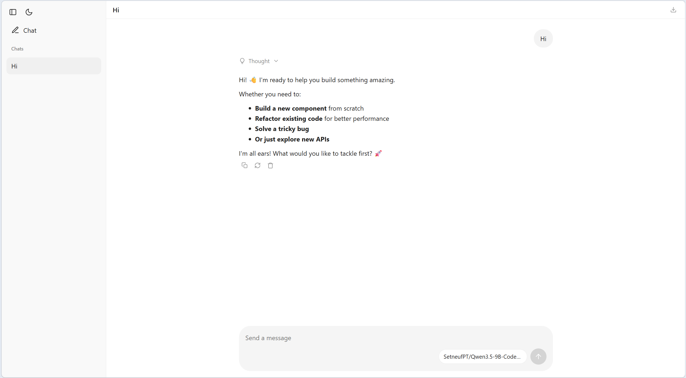

# ollama-chat

[](https://pypi.org/project/ollama-chat/)
[](https://pypi.org/project/ollama-chat/)
[](https://github.com/craigahobbs/ollama-chat/blob/main/LICENSE)
[](https://pypi.org/project/ollama-chat/)

**Ollama Chat** is a conversational AI chat client that uses [Ollama](https://ollama.com) to interact with local large language models (LLMs) entirely offline. Private, fast, no cloud.

> **Fork:** [OlegUshakov-pl/ollama-chat](https://github.com/OlegUshakov-pl/ollama-chat) — fork of [craigahobbs/ollama-chat](https://github.com/craigahobbs/ollama-chat) with redesigned UI, thinking mode, file attachments and markdown preview.

## What's new in this fork

- **Completely redesigned theme** — light / dark (`prefers-color-scheme` + `data-theme`), new sidebar / composer / messages layout, mobile-responsive. See `src/ollama_chat/static/app.css` and `src/ollama_chat/static/app.js`.
- **Thinking mode toggle** — paw button in composer. Sends `{"think": true|false}` via `startConversation` / `replyConversation` → `ChatManager(think=...)` → `ollama_chat(..., think=...)` (`src/ollama_chat/ollama.py:43`, `src/ollama_chat/chat.py:23`). Persisted in `localStorage` (`ollama-chat-thinking`). Visual state `icon-btn thinking-active` (`src/ollama_chat/static/app.css:777`).
- **File attachments** — upload button in composer. Supported: `txt`, `md`, `docx`, `png`, `jpg`, `jpeg`. Text is appended to user message, `docx` parsed with `python-docx`, images sent as base64 `images` (`src/ollama_chat/chat.py:65`, `src/ollama_chat/static/app.js:111`). File-pill with names, sending with empty text allowed.
- **Markdown viewer (.md preview in chat)** — button next to theme toggle in sidebar toolbar. Opens system file picker (`accept=".md,.markdown"`), reads file with `FileReader` and renders it **inside the chat area** via `marked` + `DOMPurify` (`src/ollama_chat/static/app.js:505`, `src/ollama_chat/static/app.css:987`). Header shows filename + `Close preview` button, `Esc` also closes. No upload to server, works offline.
- **Reliable rename** — `Rename` in chat menu now updates both sidebar and open header instantly and awaits `POST /setConversationTitle` before navigation (`src/ollama_chat/static/app.js:885`, `src/ollama_chat/static/ollamaChatConversation.bare:312`).
- **One-click Windows launch — `start.bat` / `install.bat`** — `install.bat` clones to clean folder + creates `.venv`, `start.bat` creates `.venv` if missing and forwards all args to `ollama-chat` (e.g. `start.bat -p 8080`).

## Quick start

Requirements: [Ollama](https://ollama.com/download) running + Python 3.11+ and Git on `PATH`.

### Option A — via `install.bat` (Windows, recommended)

1. Create empty folder, copy `install.bat` into it (or [download](https://github.com/OlegUshakov-pl/ollama-chat/raw/main/install.bat)).
2. Double-click `install.bat`.

   Clones to `.\ollama-chat`, creates `.venv`, `pip install -e .`.

3. 
   ```bat
   cd ollama-chat
   start.bat
   ```
   Opens http://127.0.0.1:8080/ , config is `ollama-chat.json` in home directory.

### Option B — via `start.bat` (already cloned)

```bat
git clone https://github.com/OlegUshakov-pl/ollama-chat.git
cd ollama-chat
start.bat
```

`start.bat` creates `.venv` if missing, cleans stale `~*` in `site-packages`, installs if needed, runs `ollama-chat %*`.

> If `OLLAMA_HOST` != `http://127.0.0.1:11434`, set env var before launch — see `src/ollama_chat/ollama.py:19`.

## Manual installation

**macOS / Linux**
```sh
python3 -m venv $HOME/venv --upgrade-deps
. $HOME/venv/bin/activate
pip install -e .   # or pip install ollama-chat for upstream
ollama-chat
```

**Windows (without bat)**
```bat
python -m venv %USERPROFILE%\venv --upgrade-deps
%USERPROFILE%\venv\Scripts\activate
pip install -e .
ollama-chat
```

CLI shortcuts:
```sh
ollama-chat -m "Why is the sky blue?"
ollama-chat -t askAristotle -v question "Why is the sky blue?"
```

## Features

- Offline chats with local LLMs, multiple concurrent conversations
- **Thinking toggle** (paw, `thinkingOn`/`thinkingOff`, respects model `capabilities` fallback)
- **File uploads** (`txt`/`md`/`docx` as text, `png`/`jpg`/`jpeg` as images)
- **Markdown viewer** — open local `.md` files in chat area, rendered safely
- **Rename / Delete / Download .md / Regenerate** per chat
- Prompt commands `/file`, `/dir`, `/image`, `/url`, `/do`, `/?`
- Conversation templates with `{{var}}` substitution
- Model browser, download, monitor, selection, streaming
- Show/hide thinking, Markdown/text view, export as Markdown
- Light / dark themes, responsive layout

## Usage

### Thinking mode
Paw button left of upload in composer. Persisted across restarts. Included as `{"think": bool}`. Backend honors explicit value otherwise falls back to model capabilities (`src/ollama_chat/ollama.py:57`). Active class `icon-btn thinking-active`.

### File attachments
Click upload icon → select files → names in `file-pill` → Send. Read via `FileReader` (`src/ollama_chat/static/app.js:111`), attached server-side (`src/ollama_chat/chat.py:65`).

### Markdown viewer
1. Click document icon **next to theme button** in top-left toolbar (sidebar).
2. Pick a `.md` / `.markdown` file.
3. File content renders **in the chat area** (`messages` pane) as sanitized Markdown (`window.marked` + `window.DOMPurify`). Header shows filename.
4. `Close preview` button or `Esc` or navigation clears `state.mdViewer` and returns to chat. State is in-memory only, not sent to server. Code blocks get language label + copy button via `enhanceCodeBlocks()`.

### Prompt commands
Implemented in `src/ollama_chat/chat.py`:

- `/file README.md` — include file
- `/image image.jpeg` — include image
- `/dir src/ollama_chat py` — include directory files
- `/url https://...` — include URL resource
- `/do city-report -v CityState "Seattle, WA"` — execute template
- `/?` — list commands, `/file -h` for help

### Conversation templates
- **Create:** `Add Template` (home) or `Template` (conversation page)
- **Run:** click title on home; if variables `{{var}}`, prompts for values then creates conversation
- **Edit:** home → `Select` → `Edit` (title, name, variables, prompts)

## Add a desktop launcher

**macOS** — drag `ollama-chat` executable to Dock.

**Windows** — right-click `ollama-chat.exe` → Pin to Start; or pin `start.bat`.

**GNOME (Linux)**
```
[Desktop Entry]
Name=Ollama Chat
Exec=sh -c "$HOME/venv/bin/ollama-chat"
Type=Application
Icon=dialog-information
Terminal=true
Categories=Utility;
```
```
nano $HOME/.local/share/applications/ollama-chat.desktop
```

## File format and API

[Ollama Chat File Format](https://craigahobbs.github.io/ollama-chat/api.html#var.vName='OllamaChatConfig')
[Ollama Chat API](https://craigahobbs.github.io/ollama-chat/api.html)
Schema: `src/ollama_chat/static/ollamaChat.smd` — fork adds `think`/`files` to `StartConversation`/`ReplyConversation`/`StartTemplate`.

## Development

Built with [python-build](https://github.com/craigahobbs/python-build#readme). Started via [python-template](https://github.com/craigahobbs/python-template#readme):
```
template-specialize python-template/template/ ollama-chat/ -k package ollama-chat -k name 'Craig A. Hobbs' -k email 'craigahobbs@gmail.com' -k github 'craigahobbs' -k noapi 1
```
```sh
make test        # backend tests (urllib3 mocked)
make test-app    # BareScript frontend tests (TEST="exact name")
make lint        # + pylint on static/models/models.py
make run ARGS='...'  # start app from default venv
```

Upstream: https://github.com/craigahobbs/ollama-chat · Fork: https://github.com/OlegUshakov-pl/ollama-chat
